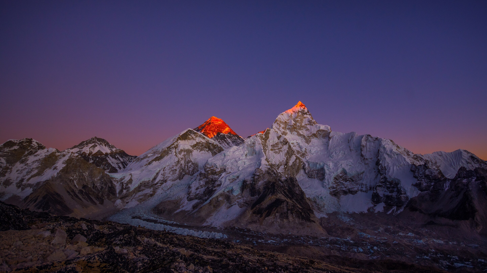

# 珠峰·夜 Zhufeng Night

高原星空为底、雪白为字、冰川蓝为印的深色主题，浅色版为 zhufeng。

壁纸来源（按授权要求署名；CC BY-SA 作品的改编版同样以 CC BY-SA 提供）：
1. Sunset view of Everest.jpg — Nir B. Gurung，CC BY-SA 4.0（Wikimedia Commons）
2. Sunset on Everest, Lhotse and Nuptse.jpg — Nirojsedhai，CC BY-SA 4.0（Wikimedia Commons）
3. Sunset Glow on Mount Everest.jpg — Megaurab09，CC BY-SA 4.0（Wikimedia Commons）
4. Everest Lhotse Makalu sunset.jpg — Lindsey Nicholson，CC BY 2.0（Wikimedia Commons）
5. Rongbuk Monastery, Tibet (50892131941).jpg — Mondo79，CC BY 2.0（Wikimedia Commons）

## 安装

```bash
omarchy theme install https://github.com/rwanglq-ctrl/omarchy-zhufeng-night-theme
```


